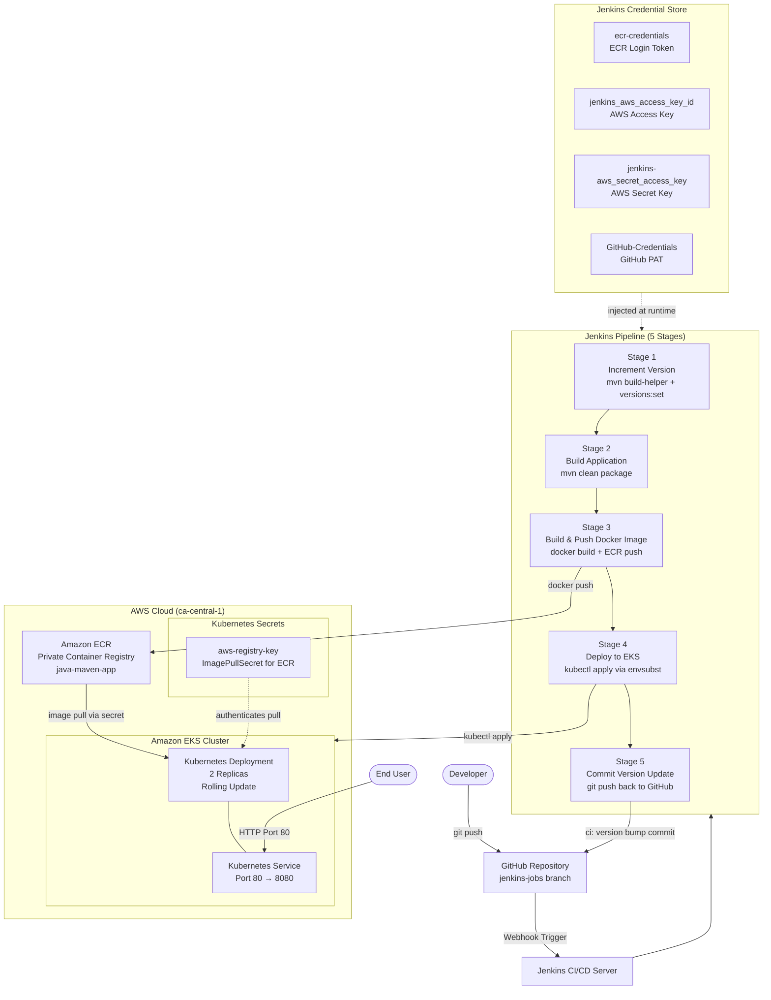

# Java Maven App — Automated CI/CD Pipeline to AWS EKS

[](https://www.jenkins.io/)
[](https://aws.amazon.com/)
[](https://kubernetes.io/)
[](https://aws.amazon.com/ecr/)
[](https://www.java.com/)
[](https://spring.io/projects/spring-boot)
[](https://www.docker.com/)
[](https://maven.apache.org/)

---

## Table of Contents

- [Project Overview](#project-overview)
- [Why This Project Matters](#why-this-project-matters)
- [Architecture](#architecture)
- [Technology Stack](#technology-stack)
- [Repository Structure](#repository-structure)
- [Prerequisites](#prerequisites)
- [Configuration Guide](#configuration-guide)
  - [1. AWS Infrastructure Setup](#1-aws-infrastructure-setup)
  - [2. Amazon ECR Repository](#2-amazon-ecr-repository)
  - [3. EKS Cluster Setup](#3-eks-cluster-setup)
  - [4. Jenkins Setup](#4-jenkins-setup)
  - [5. Jenkins Credentials Configuration](#5-jenkins-credentials-configuration)
  - [6. Kubernetes ECR Secret](#6-kubernetes-ecr-secret)
  - [7. Jenkins Pipeline Configuration](#7-jenkins-pipeline-configuration)
- [CI/CD Pipeline Stages](#cicd-pipeline-stages)
- [Kubernetes Manifests](#kubernetes-manifests)
- [Application Details](#application-details)
- [Environment Variables](#environment-variables)
- [Security Considerations](#security-considerations)
- [Troubleshooting](#troubleshooting)

---

## Project Overview

This project demonstrates an **enterprise-grade, fully automated CI/CD pipeline** that builds, containerizes, versions, and deploys a Java Spring Boot application to a production-ready **AWS Elastic Kubernetes Service (EKS)** cluster — with zero manual intervention after a code commit.

The pipeline enforces **automated semantic versioning**, **immutable Docker image tagging**, and **GitOps-style version commits** back to source control — reflecting real-world DevOps practices used at scale.

---

## Why This Project Matters

| Challenge | Solution Implemented |
|---|---|
| Manual deployments are slow and error-prone | Fully automated Jenkins pipeline triggered on every commit |
| Inconsistent application versions across environments | Automated Maven patch version increment on every build |
| No image traceability between builds and deployments | Docker images tagged with `version-buildNumber` (e.g., `1.1.12-42`) |
| Secrets exposed in code or logs | All credentials managed via Jenkins Credential Store |
| Infrastructure not scalable | 2-replica Kubernetes Deployment on AWS EKS with rolling updates |
| Manual cluster authentication | AWS IAM credentials injected at deploy stage only |
| Container registry not integrated | Automated ECR login and image push in pipeline |

This project demonstrates proficiency in the full DevOps lifecycle: **source control → build automation → containerization → image registry → container orchestration → automated GitOps feedback loop**.

---

## Architecture



---

## Technology Stack

| Layer | Technology | Purpose |
|---|---|---|
| **Application** | Java 8 / Spring Boot 2.3.4 | RESTful web application |
| **Build Tool** | Apache Maven 3.9 | Dependency management, packaging, version control |
| **Containerization** | Docker / Amazon Corretto 8 (Alpine) | Lightweight, production-ready JRE image |
| **CI/CD** | Jenkins (Declarative Pipeline) | Automated build, test, push, deploy |
| **Container Registry** | Amazon ECR | Private, IAM-secured Docker image registry |
| **Orchestration** | Kubernetes (AWS EKS) | Container scheduling, scaling, self-healing |
| **Cloud Provider** | Amazon Web Services | EKS, ECR, IAM — region: `ca-central-1` |
| **Version Control** | GitHub | Source of truth with GitOps version feedback loop |
| **Secret Management** | Jenkins Credentials Store | Secure injection of AWS and GitHub credentials |

---

## Repository Structure

```
Java-Maven-App-EKS-Cluster/
├── Jenkinsfile                    # Declarative Jenkins pipeline (5 stages)
├── Dockerfile                     # Multi-stage container image definition
├── pom.xml                        # Maven project config & version management
├── .gitignore
├── kubernetes/
│   ├── deployment.yaml            # K8s Deployment — 2 replicas, envsubst templating
│   └── service.yaml               # K8s Service — port 80 → 8080
└── src/
    └── main/
        ├── java/
        │   └── com/example/
        │       └── Application.java   # Spring Boot entry point
        ├── resources/
        │   └── static/
        │       └── index.html         # Static web UI
        └── test/
            └── java/
                └── AppTest.java       # JUnit unit tests
```

---

## Prerequisites

Before beginning, ensure the following tools are installed and configured:

| Tool | Version | Purpose |
|---|---|---|
| AWS CLI | v2+ | AWS authentication and EKS cluster access |
| `kubectl` | v1.24+ | Kubernetes cluster management |
| `eksctl` | v0.150+ | EKS cluster provisioning |
| Docker | v20+ | Building and pushing container images |
| Jenkins | LTS | CI/CD pipeline execution |
| Java JDK | 8 | Local development/build |
| Maven | 3.9 | Local build and test |
| `gettext` (envsubst) | any | Kubernetes manifest variable substitution |

---

## Configuration Guide

### 1. AWS Infrastructure Setup

Configure your AWS CLI with credentials that have permissions for EKS, ECR, and IAM:

```bash
aws configure
# AWS Access Key ID: <your-access-key>
# AWS Secret Access Key: <your-secret-key>
# Default region name: ca-central-1
# Default output format: json
```

Verify connectivity:

```bash
aws sts get-caller-identity
```

---

### 2. Amazon ECR Repository

Create the private ECR repository that will store your Docker images:

```bash
aws ecr create-repository \
  --repository-name java-maven-app \
  --region ca-central-1
```

Note your registry URI — it follows the pattern:
```
<account-id>.dkr.ecr.ca-central-1.amazonaws.com/java-maven-app
```

Authenticate Docker to ECR (for local testing):

```bash
aws ecr get-login-password --region ca-central-1 \
  | docker login --username AWS --password-stdin \
  <account-id>.dkr.ecr.ca-central-1.amazonaws.com
```

---

### 3. EKS Cluster Setup

Create the EKS cluster using `eksctl`:

```bash
eksctl create cluster \
  --name java-maven-cluster \
  --region ca-central-1 \
  --nodegroup-name standard-workers \
  --node-type t3.medium \
  --nodes 2 \
  --nodes-min 1 \
  --nodes-max 3 \
  --managed
```

> This process takes approximately 15–20 minutes. `eksctl` automatically updates your `~/.kube/config`.

Verify the cluster is running:

```bash
kubectl get nodes
kubectl cluster-info
```

---

### 4. Jenkins Setup

#### Install Required Jenkins Plugins

Navigate to **Manage Jenkins → Plugin Manager** and install:

| Plugin | Purpose |
|---|---|
| `Pipeline` | Declarative pipeline support |
| `Git` | GitHub repository checkout |
| `Credentials Binding` | Secure credential injection into pipeline |
| `Docker Pipeline` | Docker build/push commands in pipeline |
| `Kubernetes CLI` | `kubectl` access from pipeline |

#### Configure Maven in Jenkins

Navigate to **Manage Jenkins → Global Tool Configuration → Maven**:

- Click **Add Maven**
- Name: `maven-3.9`
- Version: `3.9.x` (install automatically)

#### Install kubectl and envsubst on Jenkins Agent

SSH into the Jenkins server and install the required tools:

```bash
# Install kubectl
curl -LO "https://dl.k8s.io/release/$(curl -L -s https://dl.k8s.io/release/stable.txt)/bin/linux/amd64/kubectl"
chmod +x kubectl && sudo mv kubectl /usr/local/bin/

# Install envsubst (gettext)
sudo apt-get install -y gettext-base   # Debian/Ubuntu
# or
sudo yum install -y gettext            # Amazon Linux/RHEL
```

Copy your EKS kubeconfig to the Jenkins user's home directory so `kubectl` can authenticate:

```bash
sudo cp ~/.kube/config /var/lib/jenkins/.kube/config
sudo chown jenkins:jenkins /var/lib/jenkins/.kube/config
```

---

### 5. Jenkins Credentials Configuration

Navigate to **Manage Jenkins → Credentials → System → Global credentials (unrestricted)** and add the following:

#### ECR Credentials (for Docker login)

| Field | Value |
|---|---|
| Kind | `Username with password` |
| ID | `ecr-credentials` |
| Username | `AWS` |
| Password | Output of: `aws ecr get-login-password --region ca-central-1` |

> **Note:** ECR tokens expire every 12 hours. Consider using the [Amazon ECR Credential Helper](https://github.com/awslabs/amazon-ecr-credential-helper) for production setups.

#### AWS Access Key (for EKS deploy stage)

| Field | Value |
|---|---|
| Kind | `Secret text` |
| ID | `jenkins_aws_access_key_id` |
| Secret | Your AWS Access Key ID |

#### AWS Secret Key (for EKS deploy stage)

| Field | Value |
|---|---|
| Kind | `Secret text` |
| ID | `jenkins-aws_secret_access_key` |
| Secret | Your AWS Secret Access Key |

#### GitHub Credentials (for version commit push)

| Field | Value |
|---|---|
| Kind | `Username with password` |
| ID | `GitHub-Credentials` |
| Username | Your GitHub username |
| Password | A GitHub Personal Access Token (PAT) with `repo` scope |

---

### 6. Kubernetes ECR Secret

The EKS cluster needs an `ImagePullSecret` to pull images from the private ECR registry. Run this **once** against your cluster:

```bash
# Get a fresh ECR login token
ECR_PASSWORD=$(aws ecr get-login-password --region ca-central-1)

# Create the Kubernetes secret
kubectl create secret docker-registry aws-registry-key \
  --docker-server=<account-id>.dkr.ecr.ca-central-1.amazonaws.com \
  --docker-username=AWS \
  --docker-password="${ECR_PASSWORD}"
```

Verify the secret was created:

```bash
kubectl get secret aws-registry-key
```

---

### 7. Jenkins Pipeline Configuration

Create a new Jenkins Pipeline job:

1. Click **New Item** → name it `java-maven-eks-pipeline` → select **Pipeline**
2. Under **Build Triggers**, enable **GitHub hook trigger for GITScm polling**
3. Under **Pipeline**, select **Pipeline script from SCM**:
   - SCM: `Git`
   - Repository URL: `https://github.com/NduDevOps/Java-Maven-App-EKS-Cluster.git`
   - Credentials: `GitHub-Credentials`
   - Branch: `*/jenkins-jobs`
   - Script Path: `Jenkinsfile`
4. Click **Save**

#### Configure GitHub Webhook (Optional — for automatic triggers)

In your GitHub repository → **Settings → Webhooks → Add webhook**:

- Payload URL: `http://<jenkins-server-ip>:8080/github-webhook/`
- Content type: `application/json`
- Events: `Just the push event`

---

## CI/CD Pipeline Stages

The Jenkinsfile defines a **5-stage declarative pipeline**:

```
[increment version] → [build app] → [build image] → [deploy] → [commit version update]
```

### Stage 1 — Increment Version

Uses the Maven `build-helper` and `versions` plugins to automatically bump the **patch version** in `pom.xml`:

```
1.1.11  →  1.1.12
```

The Docker image tag is composed as: `<version>-<jenkins-build-number>`
Example: `1.1.12-42`

This ensures **every image is uniquely and immutably tagged** — no `:latest` anti-patterns.

### Stage 2 — Build Application

Executes `mvn clean package`, which:
- Compiles Java source code
- Runs JUnit unit tests
- Packages the application as an executable Spring Boot JAR
- Output: `target/java-maven-app-<version>.jar`

### Stage 3 — Build & Push Docker Image

- Builds a Docker image using the `Dockerfile`
- Tags it as `<ecr-repo>:<version>-<build-number>`
- Authenticates to Amazon ECR using the `ecr-credentials` Jenkins secret
- Pushes the image to ECR

### Stage 4 — Deploy to EKS

- Injects `AWS_ACCESS_KEY_ID`, `AWS_SECRET_ACCESS_KEY`, `APP_NAME`, `DOCKER_REPO`, and `IMAGE_NAME` as environment variables
- Uses `envsubst` to substitute variables into `kubernetes/deployment.yaml` and `kubernetes/service.yaml`
- Executes `kubectl apply` to perform a **rolling update** on the EKS cluster

### Stage 5 — Commit Version Update

- Pushes the updated `pom.xml` (with the new version) back to GitHub on the `jenkins-jobs` branch
- Commit message: `ci: version bump`
- Maintains a **GitOps-style audit trail** — every deployed version is recorded in source control

---

## Kubernetes Manifests

### Deployment (`kubernetes/deployment.yaml`)

| Parameter | Value |
|---|---|
| Replicas | `2` (high availability) |
| Image | `${DOCKER_REPO}:${IMAGE_NAME}` (substituted by `envsubst`) |
| Image Pull Policy | `Always` (ensures latest tag is always pulled) |
| Image Pull Secret | `aws-registry-key` |
| Container Port | `8080` |

### Service (`kubernetes/service.yaml`)

| Parameter | Value |
|---|---|
| Service Port | `80` |
| Target Port | `8080` |
| Protocol | `TCP` |
| Selector | `app=$APP_NAME` |

> The Service currently uses the default ClusterIP type. To expose externally, change to `type: LoadBalancer` to provision an AWS Elastic Load Balancer.

---

## Application Details

| Property | Value |
|---|---|
| Framework | Spring Boot 2.3.4 |
| Language | Java 8 |
| Packaging | Executable JAR (Spring Boot repackaged) |
| Base Image | `amazoncorretto:8-alpine3.17-jre` |
| Exposed Port | `8080` |
| Static Content | `src/main/resources/static/index.html` |
| Logging | Structured JSON logging via `logstash-logback-encoder` |
| Tests | JUnit 4 unit tests |

The application serves a static HTML page at `http://<service-ip>/` and logs a startup message using SLF4J on initialization.

---

## Environment Variables

The following variables are used across the pipeline and Kubernetes manifests:

| Variable | Scope | Source | Description |
|---|---|---|---|
| `DOCKER_REPO_SERVER` | Pipeline (env) | Jenkinsfile | ECR registry hostname |
| `DOCKER_REPO` | Pipeline (env) | Jenkinsfile | Full ECR repository URI |
| `IMAGE_NAME` | Pipeline (script) | Auto-generated | `<version>-<build-number>` tag |
| `APP_NAME` | Deploy stage | Jenkinsfile | Kubernetes app label (`java-maven-app`) |
| `AWS_ACCESS_KEY_ID` | Deploy stage | Jenkins credentials | AWS authentication for `kubectl` |
| `AWS_SECRET_ACCESS_KEY` | Deploy stage | Jenkins credentials | AWS authentication for `kubectl` |

---

## Security Considerations

- **No hardcoded secrets** — all credentials (AWS keys, GitHub token, ECR password) are stored in the Jenkins Credential Store and injected at runtime using `withCredentials` blocks.
- **Scoped credential injection** — AWS IAM keys are only exposed during the `deploy` stage, minimizing the blast radius of a credential leak.
- **Private container registry** — images are stored in a private Amazon ECR repository, requiring IAM authentication for both push and pull.
- **ImagePullSecret** — the Kubernetes cluster uses a dedicated `aws-registry-key` secret to authenticate with ECR, avoiding static credentials in pod specs.
- **Immutable image tags** — every build produces a uniquely tagged image (`version-buildNumber`), preventing accidental overwrites and ensuring full deployment traceability.

---

## Troubleshooting

| Issue | Likely Cause | Resolution |
|---|---|---|
| `kubectl: command not found` | kubectl not on Jenkins PATH | Install kubectl on Jenkins server and verify `/usr/local/bin` is in the Jenkins user PATH |
| `ImagePullBackOff` | ECR secret expired or missing | Recreate `aws-registry-key` secret with a fresh ECR login token |
| `envsubst: command not found` | `gettext` not installed on Jenkins | `sudo apt-get install -y gettext-base` |
| ECR push `denied: not authorized` | ECR credentials expired (12hr TTL) | Rotate the `ecr-credentials` Jenkins secret with a fresh token |
| `git push` fails in Stage 5 | GitHub PAT expired or missing `repo` scope | Regenerate GitHub PAT and update `GitHub-Credentials` in Jenkins |
| Pods not starting | Wrong image name or missing imagePullSecret | Check `kubectl describe pod <pod-name>` for detailed error |
| Version not bumping | Maven `versions` plugin misconfigured | Ensure `build-helper-maven-plugin` and `versions-maven-plugin` are available |

---

## Author

**NduDevOps**
DevOps Engineer | AWS | Kubernetes | CI/CD | Infrastructure as Code

---

*This project was built to demonstrate real-world DevOps engineering practices including automated CI/CD pipelines, container orchestration, cloud-native deployments, and GitOps workflows on AWS.*
